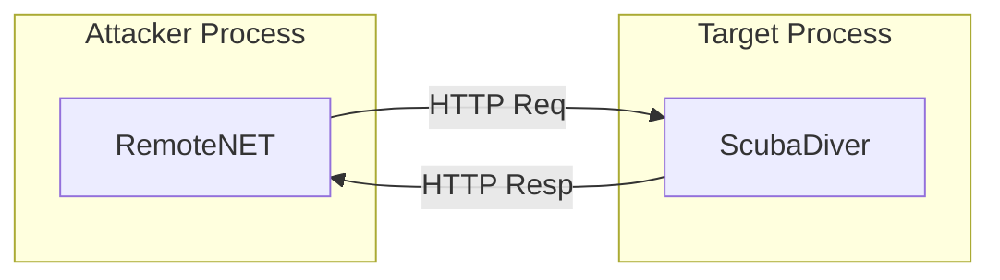
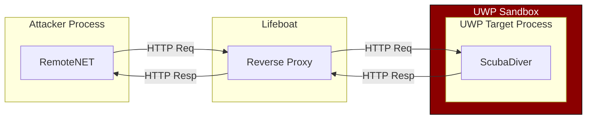

# RemoteNET Solution Structure
Normally, users of this library do not need to know much about the inner-working of it.  
Knowing the API (Usage of `RemoteApp`, `RemoteObject` and the `RemoteActivator`) should be enough.  
But in case the internal structure interests you (or you want to contribute/fix bugs) here's a short summary.

### Projects descriptions
1. **Injector** (C++) - A good ol' DLL injector. Can be compiled to x32 & x64. Supports a single parameter PID but hard-coded to inject the "Adapter" dll and nothing else.
2. **UnmanagedAdapterDLL** (C++) - The unmanaged injected dll that locates the CLR in the target and injects the managed dll (ScubaDiver).
3. **ScubaDiver** (C#) - The managed implant for our target app. It starts an HTTP server to communicate back. Uses ClrMD to inspect it's host process and other tricks to work with "borrowed" objects.
4. **ScubaDiver.API** (C#) - Common objects between ScubaDiver and RemoteNET.
5. **RemoteNET.Tester** (C#) - A CLI application to inject ScubaDiver into a process and interact with it. It's mostly used for testing while developing.
6. **RemoteNET** (C#) - The one to rule them all. This library handles both injecting the Diver into the target and further communication with it (querying objects, examining them, creating new ones...).
7. **DebuggableDummy** (C#) - A short program that runs a Diver in itself. Used for debugging.

### Architecture
When using the program, you'll be running in one of two configurations, depending on the target's type.
The difference is "regular" apps vs UWP apps.

For "regular" apps, this is where the different dlls/assemblies go:

UWP apps are run sandboxed with less networking capabilities.  
Running a HTTP server in an arbitrary UWP app was too hard to figure out, so we use a "trick" for those:  
Creating outgoing TCP Connections from UWP apps is often permitted. We'll abuse that to connect to a reverse proxy process called "Lifeboat".

### Diver communication
The `ScubaDiver.Diver` class does all the heavy lifting within the target process.  
It's mostly idle, waiting for HTTP commands so it can send back resutls.  
Most of the Diver's power comes from the [ClrMD](https://github.com/microsoft/clrmd) library by Microsoft.  

#### Protocol
The Diver's class contains mostly HTTP handlers which reflect the entire protocol. Here are some supported function:
* /type - Dumps a specific type (fields, properties, methods).
* /heap - Dumps objects of the heap. Can be narrowed down using a filter on the objects' types.
* /create_object - Constructs a new remote object.
* /object - Dumps object's address, type name, fields, properties. Also allows pinning of the object for later use.
* /invoke - Invokes a function on a remote pinned object.
* /unpin - Unpins an object pinned with '/object'.
* /domains - Returns a list of domains in the remote app.
* /types - Returns a list of all types within a specific remote assembly.
* /die - Signal to the Diver to exit.

The full list can be found in the construor of `ScubaDiver.Diver`.

#### Interaction with objects
A notable feature missing from ClrMD (but not from ScubaDiver) is the ability to invoke methods (including "getters" of properties).  
This comes from ClrMD's approach to inspect memory dumps and not interact with live objects.  
To overcome this, the Diver first needs to get a reference to the manipulated object and then use reflection to invoke methods/read properties.  
If you play with ClrMD for a while you'll find out that getting the object's address is quite easy but turning that `IntPtr` back into an object is a near impossible task in raw C#.  
Luckily, [KeeFarce](https://github.com/denandz/KeeFarce) had this figured out. Its ["Converter" Class](https://github.com/denandz/KeeFarce/blob/master/src/KeeFarceDLL/Converter.cs) is a very unique piece of code.  
It uses a trick of compiling a function directly from IL to return the `IntPtr` it recieves as the "result's address".  
 Luckily the runtime auto-magiclly converts this to an `object` when returned.  
Getting that `object` gives us a lot of power - We can now use `.GetType()` on it, explore it's `MethodInfo`s and `PropertyInfos` and invoke them :)  
Unfortunatly this power comes with a cost. Converting `IntPtr`s back to objects without the runtime to hold our hands is a risky task.  
.NET's GC just turned from our best friend into our enemy.  
If GC happens between retrival of the `IntPtr` address to actually making it into a reference the object might move around the program memory.  
That means the address we are now going to "dereference" might be just about anything!  
De-allocated? Zeroed? hell, it might even contain a completely valid object of a differenmt type!

There is some things that can be done to reduce this risk.  
Currently 2 are in place in the Diver:  
1. When handling a "Get Object" request, the Diver "refreshes" it's state (Creates another dump of the process) to see if there's still an object at that address.
2. Right before calling the "IntPtr to Object" function it checks that the Method Table (MT) address stored at the address has the expected MT value.
This narrows down the possibily of "bad deref" to only the cases where a GC occures right between the last check and the function's invocation.  
It's not perfect but it seems good enough for now.
